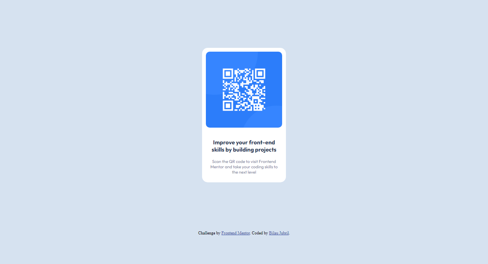

# Frontend Mentor - QR code component solution

This is a solution to the [QR code component challenge on Frontend Mentor](https://www.frontendmentor.io/challenges/qr-code-component-iux_sIO_H). Frontend Mentor challenges help you improve your coding skills by building realistic projects. 

## Table of contents

- [Overview](#overview)
  - [Screenshot](#screenshot)
- [My process](#my-process)
  - [Built with](#built-with)
  - [What I learned](#what-i-learned)
- [Author](#author)

## Overview
The QR code component challenge is a direct first-step face on with HTML and CSS

### Screenshot

## My process
Just basic HTML and CSS
### Built with

- Semantic HTML5 markup
- CSS custom properties

### What I learned

This practice project allowed me direct bout with the css box model and typography, I'm glad i tried. this is the first of many coming from me. LFG Techies

## Author

- Name - [Bilau Jubril]
- Frontend Mentor - [@JubrilKolade](https://www.frontendmentor.io/profile/JubrilKolade)
- Twitter - [@jhubhreal](https://www.twitter.com/jhubhreal)

